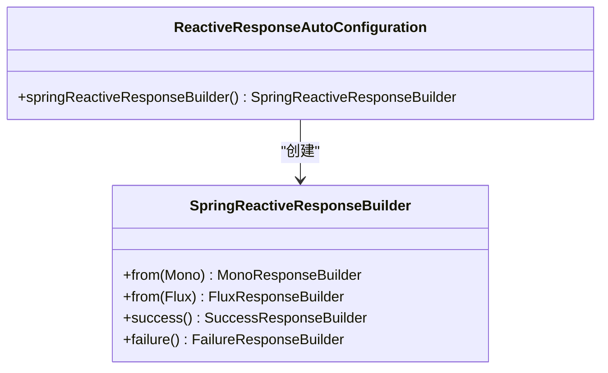
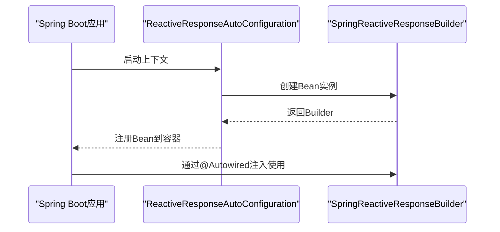
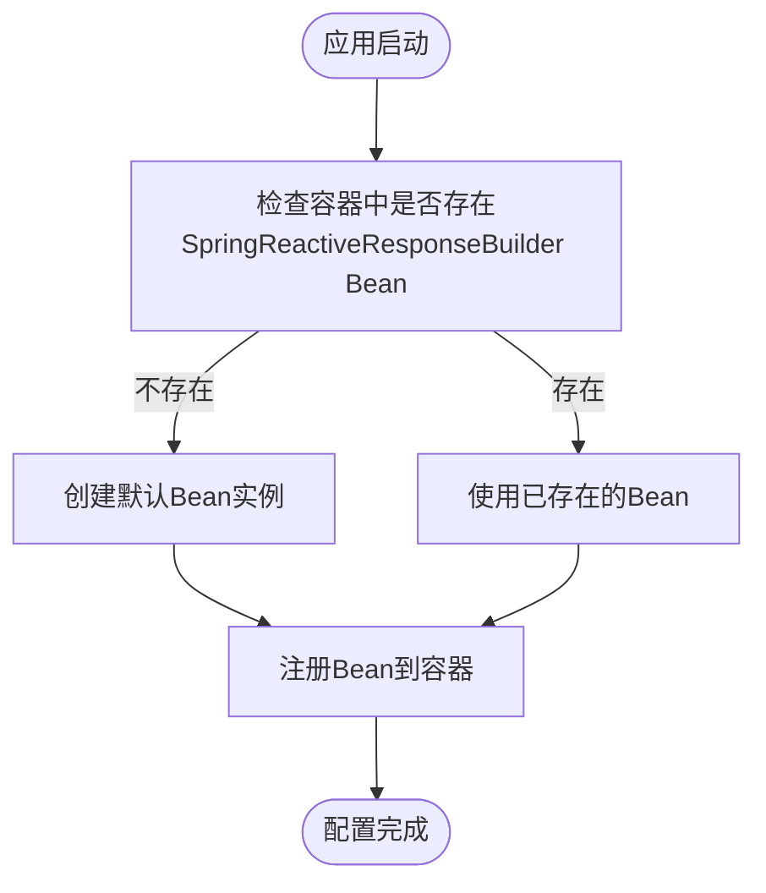

# 配置与集成

本文档详细说明了 `reactive-response` 库的配置与集成机制，重点介绍其在 Spring Boot 环境下的自动配置实现方式，以及在不同环境下的集成方法。

## Spring Boot自动配置

### 自动配置机制

`reactive-response` 库通过标准的 Spring Boot 自动配置机制实现无缝集成。`ReactiveResponseAutoConfiguration` 类作为自动配置入口，利用 Spring Boot 的 `@AutoConfiguration` 注解，在应用启动时自动注册必要的 Bean。

#### 核心配置类

```java
@Configuration
@AutoConfiguration
@ComponentScan(basePackages = "io.github.hzcssss.reactive.response")
public class ReactiveResponseAutoConfiguration {
    
    @Bean
    @ConditionalOnMissingBean
    public SpringReactiveResponseBuilder springReactiveResponseBuilder() {
        return new SpringReactiveResponseBuilder();
    }
}
```

#### 工作原理



该机制遵循 Spring Boot 的自动配置最佳实践，通过 `@AutoConfiguration` 注解自动声明配置类，使得开发者只需将库添加到项目依赖中，即可获得开箱即用的功能。

### 自动装配实现原理

#### Bean注册流程



#### 组件扫描

通过 `@ComponentScan` 注解，Spring 容器会扫描 `io.github.hzcssss.reactive.response` 包下的所有组件，确保所有相关的服务类和工具类都能被正确注册。

```java
@ComponentScan(basePackages = "io.github.hzcssss.reactive.response")
```

这确保了以下组件的自动注册：
- `SpringReactiveResponseBuilder` - 主要的响应构建器
- `ReactiveResponseService` - 服务层组件
- 其他工具类和助手组件

### 条件性配置与覆盖机制

#### 条件性配置

通过 `@ConditionalOnMissingBean` 注解实现了条件性配置，确保只有在 Spring 容器中不存在 `SpringReactiveResponseBuilder` 类型的 Bean 时，才会创建默认的 Bean 实例。

```java
@Bean
@ConditionalOnMissingBean
public SpringReactiveResponseBuilder springReactiveResponseBuilder() {
    return new SpringReactiveResponseBuilder();
}
```

#### 覆盖机制

当开发者在自己的配置类中定义 `SpringReactiveResponseBuilder` Bean 时，由于 `@ConditionalOnMissingBean` 的条件不满足，自动配置将不会创建默认 Bean，从而实现了无缝覆盖。



#### 自定义配置示例

```java
@Configuration
public class CustomResponseConfiguration {
    
    @Bean
    public SpringReactiveResponseBuilder springReactiveResponseBuilder() {
        return new CustomSpringReactiveResponseBuilder();
    }
}

public class CustomSpringReactiveResponseBuilder extends SpringReactiveResponseBuilder {
    
    @Override
    public <T> MonoResponseBuilder<T> from(Mono<T> mono) {
        return new CustomMonoResponseBuilder<>(mono);
    }
    
    private class CustomMonoResponseBuilder<T> extends MonoResponseBuilder<T> {
        
        public CustomMonoResponseBuilder(Mono<T> mono) {
            super(mono);
        }
        
        @Override
        public Mono<ReactiveResponse<T>> build() {
            return super.build()
                .onErrorResume(e -> {
                    // 自定义错误处理逻辑
                    ReactiveResponse<T> response = new ReactiveResponse<>();
                    response.setSuccess(false);
                    response.setErrorCode(9998);
                    response.setMessage("自定义错误: " + e.getMessage());
                    response.setTimestamp(System.currentTimeMillis());
                    return Mono.just(response);
                });
        }
    }
}
```

### 依赖管理与版本兼容性

#### provided 和 optional 依赖策略

在 `pom.xml` 中，Spring Boot 相关依赖被声明为 `provided` 和 `optional`：

```xml
<dependency>
    <groupId>org.springframework.boot</groupId>
    <artifactId>spring-boot-autoconfigure</artifactId>
    <version>${spring-boot.version}</version>
    <scope>provided</scope>
    <optional>true</optional>
</dependency>

<dependency>
    <groupId>org.springframework</groupId>
    <artifactId>spring-webflux</artifactId>
    <version>5.3.31</version>
    <scope>provided</scope>
    <optional>true</optional>
</dependency>
```

这种策略具有以下优势：

- **避免版本冲突**：`provided` 范围表示这些依赖由使用该库的应用提供，不会强制引入特定版本
- **减少依赖传递**：`optional` 标记确保这些依赖不会被传递到使用该库的项目中
- **提高兼容性**：允许库在不同版本的 Spring Boot 环境中正常工作

#### 支持的 Spring Boot 版本范围

根据 `pom.xml` 中的配置，该库基于 Spring Boot 2.7.18 开发，但由于使用了 `provided` 依赖策略，理论上可以兼容所有支持相同 API 的 Spring Boot 2.x 版本。

**推荐的 Spring Boot 版本范围：**

- **最低版本**：2.5.0（确保支持 `@AutoConfiguration` 注解）
- **测试版本**：2.7.18（官方测试通过）
- **最高版本**：3.x（理论兼容，需要 Java 17+）

## 集成指南

### Spring Boot 项目集成

#### 1. 添加依赖

```xml
<dependency>
    <groupId>io.github.hzcssss</groupId>
    <artifactId>reactive-response-builder</artifactId>
    <version>1.0.2</version>
</dependency>
```

#### 2. 验证自动配置

启动应用后，检查日志确认自动配置生效：

```properties
# application.properties
logging.level.io.github.hzcssss.reactive.response=DEBUG
```

#### 3. 依赖注入使用

```java
@RestController
public class ApiController {
    
    private final SpringReactiveResponseBuilder responseBuilder;
    
    public ApiController(SpringReactiveResponseBuilder responseBuilder) {
        this.responseBuilder = responseBuilder;
    }
    
    @GetMapping("/api/data")
    public Mono<ReactiveResponse<String>> getData() {
        return responseBuilder.success("数据获取成功")
                .build();
    }
}
```

### 非 Spring 项目集成

#### 1. 直接使用构建器

```java
public class NonSpringService {
    
    private final ReactiveResponseBuilder responseBuilder = new ReactiveResponseBuilder();
    
    public Mono<ReactiveResponse<String>> processData() {
        return responseBuilder.success("处理完成")
                .message("数据处理成功")
                .build();
    }
}
```

#### 2. 使用静态工具方法

```java
import static io.github.hzcssss.reactive.response.util.ReactiveResponseUtil.*;

public class UtilBasedService {
    
    public Mono<ReactiveResponse<String>> quickResponse() {
        return success("快速响应", "操作成功");
    }
    
    public Mono<ReactiveResponse<Object>> errorResponse() {
        return error("操作失败", 500);
    }
}
```

### 配置属性定制

#### 1. 全局响应配置

```java
@Configuration
public class ResponseConfiguration {
    
    @Bean
    @Primary
    public SpringReactiveResponseBuilder customResponseBuilder() {
        return new SpringReactiveResponseBuilder() {
            @Override
            public <T> SuccessResponseBuilder<T> success() {
                return super.success()
                        .errorCode(200)  // 默认成功码
                        .message("操作成功"); // 默认成功消息
            }
        };
    }
}
```

#### 2. 自定义异常处理器

```java
@Component
public class GlobalExceptionHandler {
    
    private final SpringReactiveResponseBuilder responseBuilder;
    
    public ResponseCode handleBusinessException(BusinessException ex) {
        // 记录日志
        log.warn("业务异常: {}", ex.getMessage());
        
        // 映射到标准响应码
        return mapToResponseCode(ex.getErrorCode());
    }
    
    public ResponseCode handleSystemException(Throwable ex) {
        // 记录错误日志
        log.error("系统异常", ex);
        
        // 返回通用错误码
        return ResponseCode.ERROR;
    }
    
    private ResponseCode mapToResponseCode(int errorCode) {
        return switch (errorCode) {
            case 1001 -> ResponseCode.UNAUTHORIZED;
            case 1002 -> ResponseCode.FORBIDDEN;
            case 1003 -> ResponseCode.PARAMETER_ERROR;
            case 1004 -> ResponseCode.NOT_FOUND;
            default -> ResponseCode.ERROR;
        };
    }
}
```

### 故障排除

#### 常见问题及解决方案

##### 1. Bean 注入失败

**问题描述：**
```
Could not autowire. No beans of 'SpringReactiveResponseBuilder' type found.
```

**解决方案：**
- 确认已添加正确的依赖
- 检查 Spring Boot 版本兼容性
- 验证包扫描路径是否正确

```java
// 手动指定包扫描
@SpringBootApplication
@ComponentScan(basePackages = {
    "com.yourpackage",
    "io.github.hzcssss.reactive.response"
})
public class Application {
    public static void main(String[] args) {
        SpringApplication.run(Application.class, args);
    }
}
```

##### 2. 版本冲突排查

**排查步骤：**

1. 检查项目中实际使用的 Spring Boot 版本
2. 使用 Maven 依赖分析命令：
   ```bash
   mvn dependency:tree -Dincludes=io.github.hzcssss:reactive-response-builder
   ```
3. 如果存在冲突，可以通过 `dependencyManagement` 显式指定版本：
   ```xml
   <dependencyManagement>
       <dependencies>
           <dependency>
               <groupId>org.springframework.boot</groupId>
               <artifactId>spring-boot-dependencies</artifactId>
               <version>2.7.18</version>
               <type>pom</type>
               <scope>import</scope>
           </dependency>
       </dependencies>
   </dependencyManagement>
   ```

##### 3. 响应格式异常

**问题描述：**
响应格式不符合预期或缺少某些字段。

**解决方案：**
- 检查 Jackson 配置
- 确认响应对象的序列化设置
- 验证时区和时间戳格式

```properties
# application.properties
spring.jackson.time-zone=Asia/Shanghai
spring.jackson.date-format=yyyy-MM-dd HH:mm:ss
```

### 性能优化建议

#### 1. Bean 作用域优化

`SpringReactiveResponseBuilder` 默认为单例 Bean，在高并发场景下性能良好：

```java
@Component
@Scope("singleton")  // 默认作用域，线程安全
public class ResponseService {
    
    private final SpringReactiveResponseBuilder responseBuilder;
    
    // 单例注入，避免重复创建
    public ResponseService(SpringReactiveResponseBuilder responseBuilder) {
        this.responseBuilder = responseBuilder;
    }
}
```

#### 2. 异常处理器缓存

对于复杂的异常处理逻辑，可以考虑缓存处理器：

```java
@Configuration
public class PerformanceConfiguration {
    
    private final Map<Class<? extends Throwable>, Function<Throwable, ResponseCode>> 
            exceptionHandlers = new ConcurrentHashMap<>();
    
    @PostConstruct
    public void initHandlers() {
        exceptionHandlers.put(BusinessException.class, 
            ex -> ((BusinessException) ex).getResponseCode());
        exceptionHandlers.put(DataAccessException.class, 
            ex -> ResponseCode.ERROR);
    }
    
    public Function<Throwable, ResponseCode> getHandler(Class<? extends Throwable> type) {
        return exceptionHandlers.getOrDefault(type, ex -> ResponseCode.ERROR);
    }
}
```

## 最佳实践

### 1. 配置分离

将响应相关配置集中管理：

```java
@ConfigurationProperties(prefix = "reactive.response")
@Configuration
public class ResponseProperties {
    
    private String defaultSuccessMessage = "操作成功";
    private int defaultSuccessCode = 200;
    private boolean enableDetailedErrorMessage = false;
    
    // getters and setters...
}
```

### 2. 环境特定配置

不同环境使用不同的错误处理策略：

```yaml
# application-dev.yml
reactive:
  response:
    enable-detailed-error-message: true
    default-success-message: "开发环境-操作成功"

# application-prod.yml
reactive:
  response:
    enable-detailed-error-message: false
    default-success-message: "操作成功"
```

### 3. 监控和日志

添加响应构建的监控指标：

```java
@Component
public class ResponseMetrics {
    
    private final MeterRegistry meterRegistry;
    private final Counter successCounter;
    private final Counter errorCounter;
    
    public ResponseMetrics(MeterRegistry meterRegistry) {
        this.meterRegistry = meterRegistry;
        this.successCounter = Counter.builder("response.success").register(meterRegistry);
        this.errorCounter = Counter.builder("response.error").register(meterRegistry);
    }
    
    public void recordSuccess() {
        successCounter.increment();
    }
    
    public void recordError(String errorType) {
        errorCounter.increment(Tags.of("type", errorType));
    }
}
```

---

*了解更多高级配置和自定义扩展，请参阅 [高级用法](./高级用法.md)。*